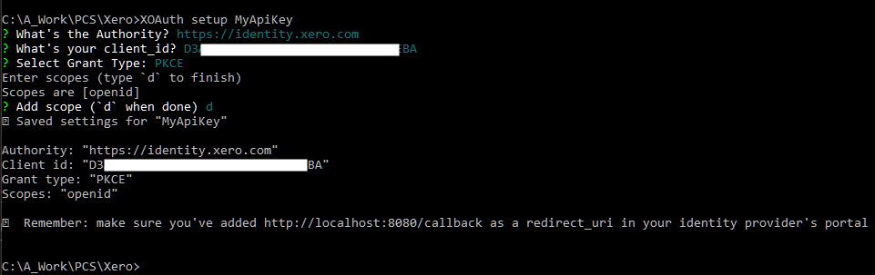

# PKCE How To for Xero OAuth2 API

## What?
This is a worked example of how to gain access to the Xero OAuth2 API without having to constantly log in via a web page.

This can be used as the basis for a *headless* system where the requirement to provide Xero an *endpoint* is not an option
(in a background web service or a windows service for example)

There are some details of how to override their Exception Factory if you need to get at exactly why the exception was thrown
(and if it was a *limit* the details of when you can retry).
There are also examples of how you can make sure of locking the refresh process.

## Why?

I could find absolutely no examples of how to do this within Xero's own documentation or within their community forums.
This is despite seeing multiple requests for examples in said forum.
I'd seen some *interesting* solutions where a web server had been included in WPF application just to get the tokens back from a launched web page.

I've provided this to (hopefully) help others save time (and reduce frustration) with their development.

## How?

### Summary

The process is based around a reusable PKCE token which can be generated by a Xero supplied application.
The *Access Token* has a 60 minute expiry, but the *Refresh Token* has at least a 30 day expiry.
So long as you refresh the token within that time frame there is no need to generate another token.

**Note: Refresh Tokens are single use**, *Access tokens can be used multiple times*

### The Process

- Generate Token
- Store details to as seed token for your application
- Refresh token (and store updated token)
- Access the API

### The Details

#### Prerequisites

- A working Xero account. You can sign up for a 30-day trial to get access
  - I would suggest setting up the Demo company as that will provide data for testing
- A user to assign the authentication to
- XOAuth from https://github.com/XeroAPI/xoauth
- Some knowledge of authorisation systems (claims, grants, scopes, etc) would be useful

#### Creating the Authorisation Token

Initially create a new Auth Code from withing the Xero's developer area:

- https://developer.xero.com/myapps/
 


This pops up a modal window where you can enter in the new *App* details


- App name needs to be unique to your organisation
- OAuth 2.0 grant type must be **Auth code with PKCE**
- Company or application URL should be a valid https link
- Privacy policy URL can be blank for an internal organisation
- OAuth 2.0 redirect URI must be **http://localhost:8080/callback**
  - **HTTP - Not HTTPS**
  - You can add others if you plan to use a different token generator
  
Creating the app will then provide the details which will allow you to generate the key


The ***Client Id*** is required to generate the reusable token with XOAuth

There is also a referral code if you are planning to supply the app to others


#### Generating the reusable token
This needs to be performed using XOAuth from a command line. There are two stages
- **Set up** which adds a new app, client id, grant type and scopes to the XOAuth's list of connections
- **Connect** which hosts a web server on port 8080 and then launches a web page which allows you to confirm the grant and scopes. You must be logged into Xero to confirm them.
 
##### XOAuth setup

I would recommend that you do a basic set up and then add the additional scopes as a second set up call.
Run `XOAuth setup <clientname>` from in a command prompt.

- Enter a name for your client (if you did not on the command line)
- Just hit enter for the Authority (it will default)
- Enter the Client Id from the App you created
- Select PKCE for the Grant Type
- Just enter "d" for the scopes (the rest are added in the next step)

Should look something like:



Now add the scopes (in a single line) using:

`XOAuth setup add-scope <clientname> openid profile email files accounting.transactions accounting.transactions.read accounting.reports.read accounting.journals.read accounting.settings accounting.settings.read accounting.contacts accounting.contacts.read accounting.attachments accounting.attachments.read offline_access`

Should look something like


##### XOAuth connect

This is the part which runs a local webserver (defaults to port 8080).
It pops up a web page to allows you to log into Xero and confirm that you want to allow a connection.
I would suggest that you log into Xero (both main and developer sites) before running this.

Run `XOAuth connect <clientname>`

This will launch the confirmation screen where you need to select the company and allow access.


Click **Allow access** will produce the tokens and display them in the web page.


These are stored in the local keychain


#### The C# Code

This code can be broken down into three sections
- Token refresh
- Obtaining a Tenant Id
- Calling the Accounts API

##### Token Refresh
*Once a token set is created the Authorisation token must be refreshed after 60 minutes.
This is performed using the Refresh token which expires in after 30 days.
The Refresh token is single use so each new token must be persisted for future use.
Once a token set has been refreshed the old set cannot be used to refresh.*

````c#
XeroClient client = null;
IXeroToken token = null;
await _semaphore.WaitAsync();
try
{
    client = new XeroClient(new XeroConfiguration { ClientId = clientId });
    if (System.IO.File.Exists("Token.json"))
    {
        var savedJson = System.IO.File.ReadAllText("Token.json");
        token = JsonConvert.DeserializeObject<XeroOAuth2Token>(savedJson);
    }
    if (token == null) token = new XeroOAuth2Token { RefreshToken = _config["RefreshToken"] };
    var newToken = await client.RefreshAccessTokenAsync(token);
    if (newToken != null) token = newToken;
    var json = JsonConvert.SerializeObject(token, Formatting.Indented);
    System.IO.File.WriteAllText("Token.json", json);
}
finally
{
    _semaphore.Release();
}
Console.WriteLine(name + ": Token refreshed");
var accessToken = token.AccessToken;
````

##### Obtaining a Tenant Id

Xero does not seem to expose the Tenant Id anywhere other than within a connections list.
Even though the Tenant Id never seems to change I would suggest getting it each time from via the API -
if you have more than one then make sure the one you want to use is still valid.

````c#
var conRes = await client.GetConnectionsAsync(token);
var tenant = conRes[0].TenantId.ToString();
````

##### Calling the Accounts API

Each Accounts API call must use the access token and tenant id.

````c#
var api = new AccountingApi();

var response = await api.GetInvoicesAsyncWithHttpInfo(accessToken, tenant);
var respInvoices = await api.GetInvoicesAsyncWithHttpInfo(accessToken, tenant, page: 1, where: "");
var invDate = respInvoices.Data._Invoices[0].Date;

var recurring = await api.GetRepeatingInvoicesAsyncWithHttpInfo(accessToken, tenant);
var status = recurring.Data._RepeatingInvoices[0].Status;
var schedule = recurring.Data._RepeatingInvoices[0].Schedule;

var contacts = await api.GetContactsAsyncWithHttpInfo(accessToken, tenant, page: 1);
var contact = await api.GetContactByContactNumberAsyncWithHttpInfo(accessToken, tenant, "Test");
````

## Finally

Whilst I had trouble with working out how to do this initially through their documentation, Xero have produced [SDKs](https://developer.xero.com/documentation/libraries/overview) for the main development systems.
*Other providers out there certainly have not!* - Amazon's Merchant Web Services and DHL's XML Services are just a bunch of XSDs. They are two examples from large multinationals who should really be producing SDKs.

The Xero SDK appears to work well - although I have not got the application I am using it in actually live yet ;)
